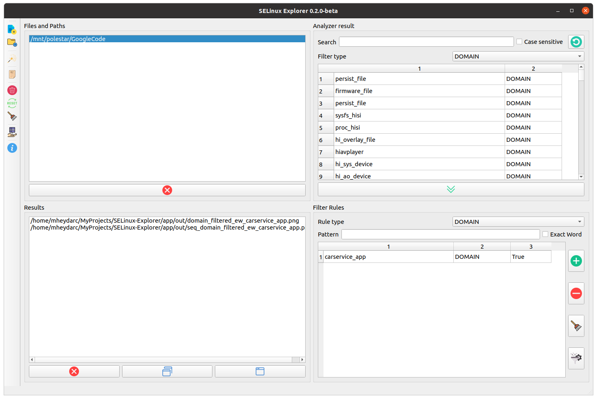
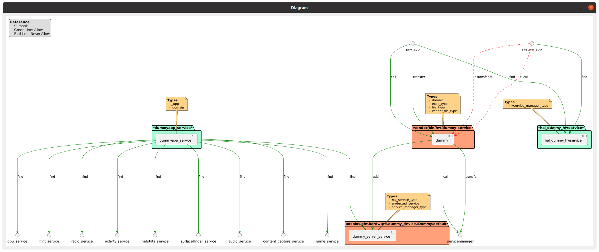
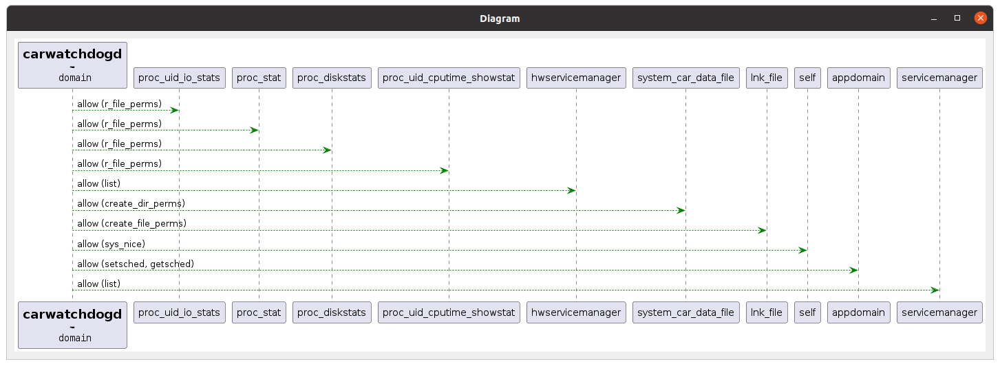

# SELinux Explorer
<br/>

SELinux Explorer is a utility designed to help developers explore SELinux policies, with a focus on Android SELinux at present. The project initially started as a command-line tool but has since evolved to include a graphical user interface (GUI) for better usability and to provide additional features such as filtering, generating custom output, and reusing data.

The tool supports the following file types:
- `file_contexts`
- `service_contexts`
- `vndservice_contexts`
- `hwservice_contexts`
- `property_contexts`
- `seapp_contexts`
- `*.te`

**Please note**: The tool is a work in progress and might have some issues or require performance improvements. We welcome any bug reports, suggestions, or contributions.

<br/>

### Screenshots of the GUI and the generated output
#### GUI

<br/>
#### Outputs

<br/>


<br/>

## Dependencies

To run SELinux Explorer, you need to have Python 3.x and some other packages installed on your local machine:

- Python 3.8 or newer
- PythonIsPython3
- Graphviz
- PyQt5
- Dataclass-wizard
- Dataclasses

## Installation
#### Note : The 1st & 2nd steps can be skipped by runnig the `setup.sh` script.
```
sudo ./setup.sh
```
&ensp;

1. Install Python 3.8 or a newer version, PythonIsPython3, Graphviz, and PyQt5:

```
sudo apt install python3.8 python-is-python3 graphviz python3-pyqt5 -y
```
&ensp;


2. Install python packages

```
pip install -r requirements.txt
```

&ensp;

3. Clone the project and its submodule:

```
git clone https://github.com/Heydarchi/SELinux-Explorer.git
```
&ensp;

4. Inside the cloned folder, run the following command to update the submodule:

```
git submodule update --init --recursive
```
<br/>

## How to Run the GUI

1. Change to the `app` directory:

```
cd app
```

2. Run the main.py script:

```
python main.py
```
<br/>
<br/>

## Development
### How to run spell check locally
There is a script to run spell check locally. It will check all the files in the `app` directory and ignore the words in the `app/config/codespell_ignore.txt` file.

```
codespell -I app/config/codespell_ignore.txt app/
```
&ensp;
### How to run spell check locally
Before pushing any changes, please run the following command to check the code style:

```
black --check app/
```
To fix the code style, run the following command:

```
black app/
```

### How to run the tests
To run the tests, run the following command:

```
pytest app/tests/
```

&ensp;

### Pattern to create a new branch
Please use the patterns below to create a new branch for your changes:
&ensp;

- feature/<feature-name>: For new features or enhancements.
- bugfix/<bug-name>: For bug fixes.
- hotfix/<issue-name>: For critical fixes that need to be merged quickly.
- refactor/<component-name>: For code refactoring.
- docs/<documentation-change>: For changes in documentation.
&ensp;

## Features and TODOs

### Analyzer

- [ ] Enable multi-threading
- [ ] Analyze only the changed files to save time
- [ ] Refactor the code architecture

### GUI

- [ ] Show the progress of the analysis
- [ ] Search the input file
- [ ] Search the generated files
- [ ] Sort result files by date
- [ ] Add AND/OR for combining the filter rules
- [ ] Create references from paths and files
- [ ] Add a new window for the reference files
- [ ] Display the number of files and folders in the list
 
## Contributing

We welcome any form of contribution, from bug reports to suggestions and code improvements. Feel free to create an issue or send a message/report.

## License

This project is released under the [MIT License](LICENSE).

